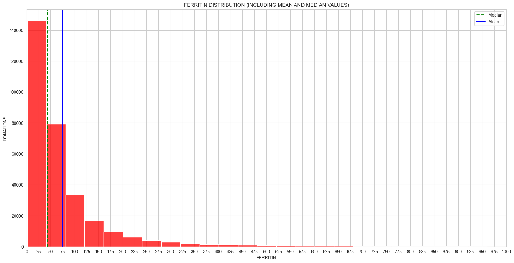

# Ferritin Levels Analysis: A Data Story

## Introduction
The ferritin interactive dashboard project aims to analyze ferritin levels across different time periods, providing insights into donor characteristics and ferritin distribution. By leveraging data from multiple sources, this project uncovers patterns and trends in ferritin levels among donors.

📊 **Interactive Dashboard:** Explore the data in real-time using the [Interactive Dashboard](https://public.tableau.com/app/profile/ty.jensen/viz/WCBSFerritinAnalysisDashboard/Dashboard3)

## Background
Ferritin monitoring in blood donors is crucial for maintaining both donor and blood supply safety. Ferritin, a protein that stores iron in the body, serves as a key indicator of iron stores. Regular monitoring helps prevent iron deficiency in donors, which can lead to anemia if left unchecked. Blood centers worldwide implement ferritin screening to:
- Protect donor health by preventing iron depletion
- Ensure high-quality blood components for transfusion
- Optimize donation intervals based on individual donor iron status
- Identify donors at risk of developing iron deficiency

## Data Sources
The analysis is based on three datasets containing ferritin results spanning from February 2022 to June 2024. These datasets include key information such as donor demographics, ferritin ratios, and donation details.

## Data Preparation
The data preprocessing involves several key steps:
- **Data Import and Cleaning:** Data from different time periods is imported and cleaned to ensure consistency.
- **Column Renaming and Reordering:** Columns are standardized across datasets to facilitate seamless analysis.
- **Data Joining:** The datasets are concatenated to form a comprehensive view of ferritin levels over time.
- **Therapeutic Donors:** A separate analysis is conducted for therapeutic donors, providing insights into this specific group.

## Data Transformation
The dataset undergoes transformation to prepare it for analysis:
- **Dropping Unnecessary Columns:** Irrelevant columns are removed to focus on essential data.
- **Data Type Conversion:** Key columns are converted to appropriate data types for accurate analysis.
- **Duplicate Removal:** Duplicate entries are identified and removed to ensure data integrity.

## Feature Engineering
To enhance the analysis, new features are engineered:
- **Ferritin Categories:** Ferritin ratios are categorized into 'very low', 'low', 'normal', 'high', and 'very high'.
- **Gender and Race:** Functions are used to infer gender and race from existing data, adding depth to the analysis.

## Key Insights and Visualizations
The analysis reveals several key insights:

- **Ferritin Distribution:** A histogram visualizes the distribution of ferritin ratios, highlighting the prevalence of different categories. This plot helps identify the most common ferritin levels among donors and any outliers.
  

- **Demographic Analysis:** Visualizations explore the relationship between ferritin levels and donor demographics, such as age, gender, and race.
  - **Age Distribution and Mean by Ferritin Category:** This plot shows how age varies across different ferritin categories, providing insights into age-related trends in ferritin levels.
    
  - **Donations vs Ferritin Category:** This visualization illustrates the number of donations corresponding to each ferritin category, highlighting which categories are most prevalent among donors.
    
  - **Donations vs Gender and Ferritin Category:** This plot examines the interaction between gender and ferritin categories, revealing potential gender differences in ferritin levels.
    
  - **Donations vs Race and Ferritin Category:** This visualization explores the relationship between race and ferritin categories, offering insights into racial disparities in ferritin levels.
    

## Conclusion
This analysis provides a comprehensive view of ferritin levels among donors, uncovering patterns that can inform future studies and interventions. The interactive dashboard serves as a valuable tool for stakeholders to explore and understand the data in depth.

## Very Low Ferritin Donor Analysis
The following plots track individual donors with very low ferritin levels (≤5.9 ng/mL) over their last six donations. This analysis helps identify patterns in ferritin depletion and recovery among frequent donors.

These visualizations reveal the progression of ferritin levels in donors categorized as 'very low', providing valuable insights into:
- Individual donor ferritin trajectories over multiple donations
- Patterns of ferritin depletion and potential recovery periods
- The impact of donation frequency on ferritin levels
- Identification of donors who may need extended donation intervals or iron supplementation
